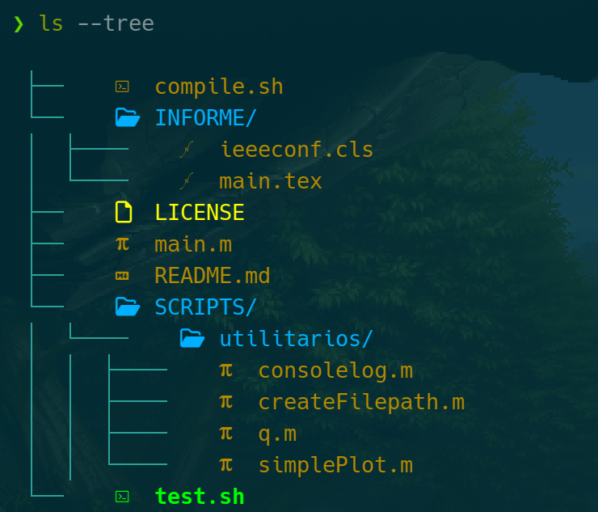

# LaTex Octave Template

Template para empezar a realizar un trabajo con informe que requiera de procesamiento de señales.

## Capturas



## Tabla de Contenido

- [Capturas](#capturas)
- [Tecnologías](#tecnologías)
- [Uso](#uso)
  - [Testeo](#testeo)
  - [Compilar](#compilar)
- [TODOs](#todos)
- [Autor](#autor)
- [Licencia](#licencia)

## Tecnologías

- Para poder compilar el código en latex se uso livetex (TeX 3.141592653) y el compilador pdflatex, con la flag -shell-escape
- [GNU Octave, version 7.1.0](https://octave.sourceforge.io/)

## Uso

### Testeo

Para hacer pruebas en desarrollo hay que correr (no se crearán gráficos)

```bash
sh test.sh
```

Si se quiere que se generen los gráficos hay que correr

```bash
sh test.sh 1
```

### Compilar

Sólo hay que correr el script compile.sh en el directorio que contiene éste archivo:

```bash
sh compile.sh
```

Éste archivo corre los scripts de octave (_main.m_), compila el pdf con _pdflatex_ y organiza, renombra y prepara todo, como debe quedar, listo para entrega dentro en la carpeta ENTREGA.

## TODOs

- [ ] .

## Autor

Creado por [@TomiVidal99](https://www.tomasvidal.xyz/)

## Licencia

This project is open source and available under the [MIT License](./LICENSE).
